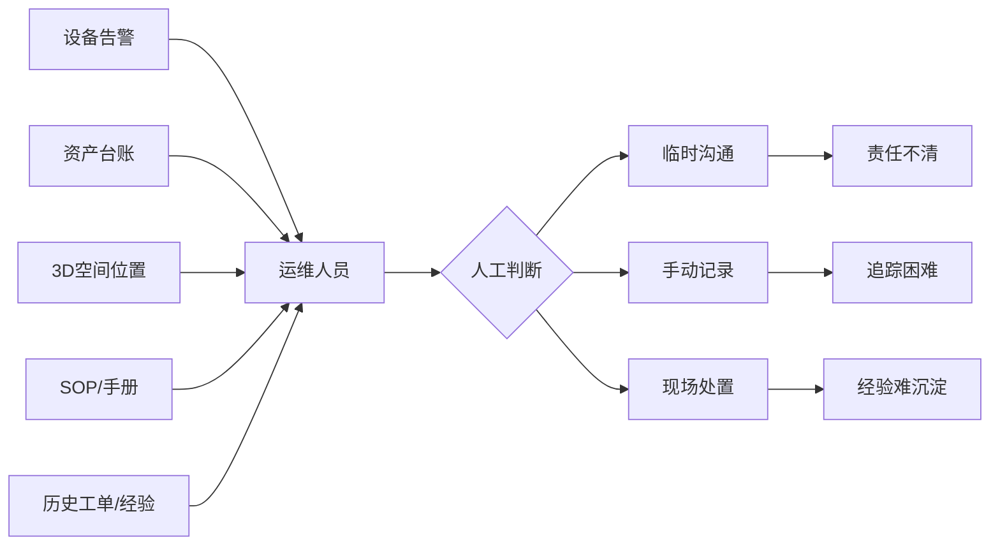
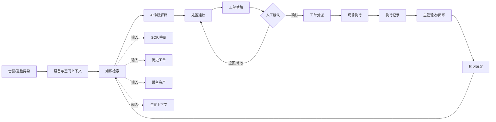

# 重绘图说明：业务断点与 AI 辅助闭环

更新时间：2026-07-03

## 用途

这两张图用于补足主案例 8 页重构稿中的页 2 和页 4/5：

- 业务断点 Before 图：解释为什么设施运维不是单点功能问题，而是信息和责任链路断裂。
- AI 辅助闭环图：解释 AI 放在业务流中的哪些节点，以及人机确认边界在哪里。

## 图 1：业务断点 Before 图

### 画面目标

让面试官一眼看懂：告警、资产、空间、SOP、历史经验和现场执行原本是分散的，所以产品价值不是“多做几个页面”，而是把这些信息重新组织进一个可追踪闭环。

### 建议标题

告警被看到，不等于问题被闭环

### Mermaid 草图

### PPT 重绘建议

- 左侧放 5 个分散信息源：设备告警、资产台账、3D 空间、SOP 手册、历史工单。
- 中间放一线运维人员，强调需要人工拼接上下文。
- 右侧放 3 个断点：责任不清、追踪困难、经验难沉淀。
- 颜色上只突出断点，不要把图画成技术架构图。

### 页面配文

设施运维现场的难点不是“缺少一个 AI 按钮”，而是关键上下文分散在不同对象、系统和角色之间。产品设计首先要解决的是可判断、可流转、可追踪，然后 AI 才能成为辅助诊断和建议生成的一环。

## 图 2：AI 辅助闭环图

### 画面目标

证明 AI 不是孤立 Chatbot，而是接入告警到工单的业务闭环；同时明确哪些环节必须由人确认。

### 建议标题

AI 辅助诊断进入可审核的工单闭环

### Mermaid 草图

### PPT 重绘建议

- 主链路横向画：告警 -> 上下文 -> 检索 -> AI 建议 -> 工单草稿 -> 人工确认 -> 执行 -> 沉淀。
- 把“人工确认”画成明显的闸门，不要画成可跳过节点。
- SOP/手册、历史工单、设备资产、告警上下文作为输入放在检索节点下方。
- 知识沉淀回到检索节点，形成闭环，但不要写成自动学习或无人审核入库。

### 页面配文

AI 的作用是把分散的设备、告警、SOP 和历史工单组织成可审核建议，辅助生成处置步骤和工单草稿。高风险动作仍由人确认，执行结果再沉淀为后续可复用的知识和案例。

## 口径边界

可以写：

- AI 辅助知识检索、原因解释、处置建议和工单草稿。
- 人工确认后进入工单分派和执行。
- 处置记录可用于后续知识复用。

不要写：

- AI 自动派单。
- AI 自动维修。
- AI 替代专家诊断。
- 已验证 ROI、准确率、节省成本等未证实指标。
