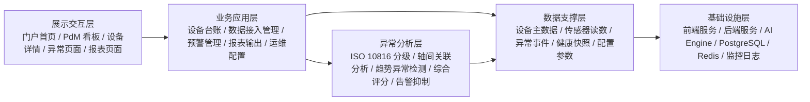
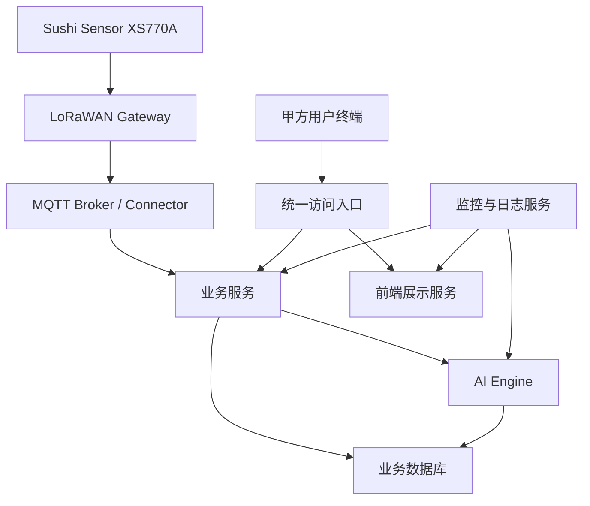

# 软件开发计划（PdM 一期交付版）

## 1. 总体系统结构设计

### 1.1 设计原则

本项目面向甲方旋转设备预测性维护一期建设目标，围绕“数据接入、异常识别、趋势分析、结果展示、运行保障”五个方面开展软件设计。系统设计遵循以下原则：

1. 一期范围清晰原则  
   本次交付范围聚焦 PdM 一期异常识别能力，仅覆盖数据接入、异常检测、预警展示、分析呈现、报表输出和运维支撑，不纳入故障诊断、专家建议和工单联动等超出需求文档范围的内容。

2. 数据驱动原则  
   以现场传感器数据为核心输入，通过统一采集、统一存储和统一分析形成设备健康判断依据，降低对人工经验和单点阈值判断的依赖。

3. 多算法融合原则  
   系统采用 ISO 10816 基线分级、轴间关联分析和趋势异常检测相结合的方式，对设备状态进行综合评估，兼顾即插即用能力、分析深度和结果稳定性。

4. 结果可解释原则  
   异常识别结果不仅给出告警结论，还保留等级、分值、趋势、轴间特征和抑制统计等关键信息，便于甲方理解判断依据并建立对系统输出的信任。

5. 降噪优先原则  
   系统针对瞬时抖动、短暂越限和低置信度异常建立抑制机制，减少无效告警干扰，突出高价值异常事件。

6. 稳定运行原则  
   系统设计兼顾一期试运行和正式交付要求，支持统一部署、健康检查、日志追踪、接口监控、备份恢复和配置维护，保障后续持续运行。

### 1.2 系统架构

本项目采用“展示交互层、业务应用层、异常分析层、数据支撑层、基础设施层”五层结构。该结构既满足一期异常识别交付要求，也便于后续在不改变现有主体架构的前提下开展功能维护和性能优化。

各层职责说明如下：

1. 展示交互层  
   面向管理人员、分析人员和运维人员提供统一使用入口，集中展示设备健康状态、异常事件、趋势变化、抑制效果和分析结果。

2. 业务应用层  
   负责承载设备对象管理、接入配置、异常结果浏览、条件筛选、报告导出和系统配置等业务功能。

3. 异常分析层  
   负责执行 PdM 一期核心算法流程，包括 ISO 分级、轴间关联特征分析、趋势检测、综合评分和告警抑制。

4. 数据支撑层  
   负责汇聚传感器读数、设备基础信息、分析结果和运行配置，为前端展示和异常分析提供统一数据来源。

5. 基础设施层  
   提供数据库、缓存、服务运行环境、接口接入、日志记录和运维监控能力，保障系统稳定运行。

### 1.3 系统部署架构

系统部署围绕现场传感器接入和平台分析展示构建，支持从采集端到展示端的完整链路。整体部署关系如下：

部署架构说明如下：

1. 现场采集链路  
   由传感器、LoRaWAN 网关和 MQTT 接入链路组成，负责将设备多通道振动与温度数据采集到平台。

2. 业务服务  
   负责设备信息管理、数据接收、异常事件查询、接口代理、报表输出和配置维护。

3. AI Engine  
   负责执行趋势分析与异常检测相关算法，并向业务服务返回结构化分析结果。

4. 数据库服务  
   负责保存设备信息、传感器读数、异常事件、健康快照和系统配置数据。

5. 前端展示服务  
   负责统一门户、看板、设备详情、异常页面和报表页面展示。

6. 运维监控服务  
   负责运行监测、日志追踪、健康检查和异常排查支撑。

### 1.4 系统安全架构

系统安全设计以“访问可控、数据可管、接口可防护、操作可审计”为目标，满足甲方一期交付后的基本安全运行要求。

1. 身份认证安全  
   系统采用统一登录认证机制，对用户登录、会话状态和令牌有效性进行控制，保障访问主体真实可信。

2. 权限控制安全  
   系统通过角色和权限控制页面访问、数据访问和配置操作，确保不同岗位在授权范围内使用系统功能。

3. 数据访问安全  
   系统对设备数据、异常事件、配置参数和分析结果进行统一存储和访问控制，降低越权访问和误操作风险。

4. 接口调用安全  
   系统对接口请求频率、异常调用和非法访问行为进行控制，保障数据接入链路和分析服务的稳定性。

5. 审计追踪安全  
   系统对关键访问、配置变更、异常处理和接口调用保留日志记录，便于运维排查和问题溯源。

## 2. 软件模块设计

### 2.1 模块设计说明

本次交付版软件模块设计严格以 PdM 一期异常识别需求为边界，不再沿用全平台通用模块清单，而是仅保留本期交付所需的核心业务模块。模块设计围绕“设备对象建立、数据接入、异常识别、结果展示、分析输出、运行保障”的业务链组织。

系统模块设计遵循以下原则：

1. 交付对齐原则  
   模块设置直接对应需求文档中的能力范围，避免出现超出本期交付边界的能力表述。

2. 结果导向原则  
   模块描述以甲方实际看到和使用到的功能结果为主，不以底层研发实现细节为主要表达方式。

3. 链路完整原则  
   模块之间围绕“采集、分析、呈现、管理”形成完整业务链，确保从数据进入平台到结果输出有明确承接关系。

4. 易展示易验收原则  
   模块命名和功能描述采用交付口径，便于后续补充系统截图、汇报材料和验收说明。

基于以上原则，本次交付范围包含八个一级业务模块，分别为：统一门户与运行总览、设备资产管理、实时监测与数据采集、告警预警管理、数据接入与系统集成、统计分析与辅助决策、报表报告与成果输出、系统配置与运维管理。

#### 2.2 统一门户与运行总览模块

功能概述：  
统一门户与运行总览模块是本期系统的统一入口和总览界面，面向甲方管理人员、分析人员和运维人员集中展示设备健康等级、异常概况、趋势状态和重点关注对象。该模块重点解决现场信息分散、异常状态难以快速总览、关键设备不易集中识别的问题。

业务价值说明：  
该模块通过统一看板视图将设备健康状态、异常数量、等级分布和趋势变化集中呈现，帮助甲方快速掌握整体运行态势，提升重点风险识别效率和日常查看效率。

应用场景：  
1. 登录系统后查看整体设备健康概览和当前异常态势。  
2. 在日常运行管理中快速定位高风险设备和重点关注对象。  
3. 在汇报或演示场景中统一展示系统识别结果和整体运行状态。  
4. 通过首页入口进入设备、异常、分析和报表等具体页面开展工作。

功能模块：  
1. 门户首页展示。  
   作为系统统一入口，集中呈现 PdM 一期核心结果，包括设备总量、异常概况、重点风险和常用入口，避免用户在多个页面之间反复切换。  
2. 设备健康等级总览。  
   基于 ISO 10816 分级结果，以 A/B/C/D 等级卡片方式展示设备健康分布，使管理人员能够在首页直接识别正常设备、关注设备和高风险设备。  
3. 异常事件数量与等级分布看板。  
   对当前周期内识别出的异常事件进行汇总，展示异常数量、严重程度分布和变化趋势，用于反映整体风险态势。  
4. 高频关注设备清单。  
   将近期异常频次高、综合分偏高或趋势持续退化的设备集中列示，帮助运维和分析人员快速锁定重点跟踪对象。  
5. 趋势变化摘要展示。  
   汇总展示设备健康趋势、等级变化方向和预测退化信息，体现“预计 X 天后等级变化”的一期核心能力。  
6. 异常抑制统计展示。  
   单独展示高置信度异常数量、低置信度抑制数量和降噪比例，直观体现平台相对传统 DCS 阈值告警的降噪价值。  
7. 快捷导航入口。  
   提供从总览页快速进入设备台账、异常事件、分析详情、报表输出和配置页面的入口，形成从总览到明细的闭环操作路径。  
8. 条件筛选与联动跳转。  
   支持按等级、设备、状态或时间条件筛选总览内容，并从卡片、榜单和图表联动跳转到对应明细页面，提升使用效率。

图 2.2-1 PdM 一期统一门户与运行总览界面  
  
说明：系统首页集中展示设备健康等级分布、异常概况和重点关注对象，便于管理人员和运维人员快速掌握当前运行态势。

#### 2.4 设备资产管理模块

功能概述：  
设备资产管理模块面向甲方旋转设备对象的统一管理需求，负责建立设备基础档案、设备分类信息、设备位置归属和传感器关联关系，为后续异常识别和结果展示提供对象基础。

业务价值说明：  
该模块通过统一设备台账和设备与传感器的映射关系，确保分析结果能够准确关联到具体设备对象，支撑设备级查询、分组统计和异常定位。

应用场景：  
1. 建立和维护纳入 PdM 一期范围的设备清单。  
2. 维护设备基础属性、所属区域和设备类型信息。  
3. 绑定设备与对应传感器、测点和分析对象。  
4. 在异常查看和趋势分析时按设备维度查询结果。

功能模块：  
1. 设备台账管理。  
   建立纳入 PdM 一期范围的旋转设备台账，记录设备名称、设备编号、设备类型、安装位置和所属范围，作为异常识别与结果呈现的基础对象。  
2. 设备分类与编码管理。  
   按泵、压缩机、电机、风机等旋转设备类型进行分类，统一编码规则，便于后续按设备类型应用不同分级口径和分析配置。  
3. 设备基础属性维护。  
   维护设备额定参数、运行状态、品牌型号、关键部件和安装信息，为设备健康解读和结果比对提供背景信息。  
4. 设备区域归属管理。  
   将设备与区域、产线或安装位置关联，使异常事件和趋势结果可以按区域和空间位置进行查看和统计。  
5. 设备与传感器绑定管理。  
   建立设备与 Sushi Sensor 及其通道之间的映射关系，明确每个分析结果对应的设备对象、测点来源和采集链路。  
6. 设备运行对象查询。  
   支持按单设备查看当前健康等级、异常状态、最近趋势和历史分析结果，满足设备级排查和复核需求。  
7. 设备列表检索与筛选。  
   支持按照设备名称、类型、状态、风险等级和异常情况进行检索与筛选，便于快速定位目标设备。  
8. 重点设备标识管理。  
   对关键设备、高风险设备和重点观测设备进行标识，便于在总览、异常和分析页面中突出展示。

图 2.4-1 设备资产台账与状态总览界面  
  
说明：系统支持按设备维度建立统一台账，并通过列表筛选与状态汇总实现设备对象的精细化管理。

#### 2.5 实时监测与数据采集模块

功能概述：  
实时监测与数据采集模块负责接收和展示传感器上送的多通道数据，支撑设备当前状态查看、历史序列回溯和趋势变化分析。该模块围绕 Sushi Sensor 多通道数据特点，承载振动和温度数据的持续采集、实时展示和历史查询。

业务价值说明：  
该模块将现场传感器数据沉淀为可持续使用的数据资产，为异常识别、趋势分析和结果复核提供统一事实依据，帮助甲方从单次读数查看过渡到连续状态观察。

应用场景：  
1. 查看设备当前振动与温度状态。  
2. 查询指定设备在一段时间内的历史数据变化。  
3. 对比不同轴向和不同指标的变化情况。  
4. 为异常识别算法提供连续输入数据。  
5. 为分析人员复核异常结果提供原始数据依据。

功能模块：  
1. 监测对象管理。  
   以设备为核心建立监测对象，明确每台设备对应的传感器、测点和采集周期，形成面向分析的监测对象集合。  
2. 多通道测点管理。  
   支持管理 Sushi Sensor 的多通道振动与温度数据，包括加速度、速度、合成值和温度等关键通道，满足一期多变量分析需要。  
3. 实时数据采集。  
   按设定采样周期持续接收现场上传数据，使设备当前运行状态能够被平台及时获取和使用。  
4. 实时监测展示。  
   在页面中展示设备当前振动值、温度值、状态摘要和最近读数，方便用户第一时间了解设备运行情况。  
5. 历史数据存储与查询。  
   对时序数据进行统一存储，支持按设备、时间范围和通道类型查询历史数据，为趋势分析和结果复核提供数据基础。  
6. 趋势曲线展示。  
   以趋势图方式展示关键指标变化过程，支持观察振动和温度的阶段性变化、波动幅度和持续退化迹象。  
7. 采集状态监控。  
   对传感器是否持续上报、采集是否中断、最近数据是否超时等状态进行监控，便于及时发现接入问题。  
8. 数据质量校验。  
   对缺失值、异常值、格式错误和时序不连续等情况进行识别和提示，保证进入分析链路的数据质量可控。

图 2.5-1 设备实时监测与历史趋势界面  
  
说明：系统支持对单设备振动与状态指标进行持续展示，并提供历史趋势回溯能力，为异常识别和人工复核提供数据依据。

#### 2.6 告警预警管理模块

功能概述：  
告警预警管理模块负责将算法识别出的异常结果转化为可查看、可筛选、可跟踪的预警事件。该模块重点体现本期“高置信度异常推送、低置信度结果抑制”的设计目标，解决简单阈值告警过多、噪声干扰强和风险事件不易聚焦的问题。

业务价值说明：  
该模块帮助甲方将异常识别结果标准化为统一事件记录，既可快速发现重点异常，也可量化展示降噪效果，体现系统相对传统阈值告警方式的应用价值。

应用场景：  
1. 当设备综合异常分达到阈值时生成异常事件。  
2. 查看不同等级、不同设备、不同时间范围内的异常结果。  
3. 区分高置信度异常、观察对象和被抑制事件。  
4. 统计阶段性异常数量、等级分布和抑制效果。  
5. 针对重点异常开展人工复核和持续观察。

功能模块：  
1. 预警触发规则管理。  
   根据一期规则定义异常事件触发条件，支持按综合异常分、置信度和状态阈值区分正式异常、观察对象和抑制结果。  
2. ISO 等级映射展示。  
   将设备速度 RMS 值映射为 ISO 10816 A/B/C/D 等级，并在异常页面中直观展示对应等级和分值。  
3. 综合异常分计算结果展示。  
   将 ISO 分级结果、轴间关联得分和趋势异常得分进行汇总，形成统一的综合异常分，便于用户理解异常强度。  
4. 异常事件列表管理。  
   以事件列表方式展示已识别的高置信度异常，记录设备名称、异常类型、等级、时间、状态和处理建议等信息。  
5. 观察对象管理。  
   对评分处于观察区间的设备建立观察列表，用于持续跟踪但不立即触发强告警，体现渐进式风险管理思路。  
6. 低置信度事件抑制统计。  
   对被 Kalman 滤波、趋势判断或综合评分判定为低置信度的事件进行抑制和统计，量化展示降噪效果。  
7. 异常筛选与条件检索。  
   支持按设备、等级、状态、异常类型和时间范围筛选异常结果，方便进行重点排查和统计分析。  
8. 异常详情查看。  
   在异常详情中展示 ISO 等级、轴间特征、趋势结果、综合评分和建议动作，帮助用户理解该异常为何被识别。

图 2.6-1 异常事件与告警预警管理界面  
  
说明：系统将识别出的异常结果转化为统一事件，并通过等级、状态、分值和筛选条件支撑预警管理与重点风险聚焦。

#### 2.8 数据接入与系统集成模块

功能概述：  
数据接入与系统集成模块负责打通现场采集链路和平台数据链路，实现传感器数据稳定入库、设备对象关联和分析服务调用。该模块重点覆盖 LoRaWAN、MQTT、业务服务和 AI Engine 之间的接入与集成关系。

业务价值说明：  
该模块保证现场数据能够稳定、规范地进入平台，并在后续展示、分析和输出过程中保持统一数据口径，是本期建设能否顺利落地的关键基础模块。

应用场景：  
1. 接收现场传感器通过网关和 MQTT 上送的数据。  
2. 对接业务服务与 AI Engine 的分析调用链路。  
3. 将数据与设备对象、通道类型和时间序列统一映射。  
4. 在实施阶段进行接入验证和数据链路联调。  
5. 在运行阶段监控接入状态并处理异常。

功能模块：  
1. MQTT 数据接入。  
   支持通过 LoRaWAN 网关与 MQTT 链路接收 Sushi Sensor 上传数据，实现现场采集数据向平台的稳定传输。  
2. 设备与通道映射配置。  
   对设备、传感器、安装点位和通道类型进行映射配置，确保每条读数能够被正确关联到具体设备和指标。  
3. 数据格式转换与入库。  
   对接入数据进行标准化转换，统一为平台可识别的数据结构后写入时序数据表，供后续分析调用。  
4. AI 分析接口调用。  
   将整理后的设备历史数据和实时数据按约定格式传递给 AI Engine，触发异常检测 pipeline 和相关分析服务。  
5. 接入结果校验。  
   对设备编号、时间戳、通道名称、数值格式和入库结果进行校验，确保接入数据完整、可用、可追溯。  
6. 接入任务调度。  
   支持按固定周期执行采集、转换、分析和结果回写任务，形成“接入—分析—展示”的稳定运行链路。  
7. 接入异常监控。  
   对接入失败、消息中断、映射错误、分析调用失败等异常情况进行监控和记录，便于及时排查。  
8. 数据链路联调支撑。  
   在实施阶段支持对传感器模板、通道预览、数据源配置和结果验证进行联调，保障交付前链路跑通。

图 2.8-1 设备与传感器模板接入配置界面  
  
说明：系统支持通过设备接入向导完成设备、传感器模板与数据源配置，为现场数据稳定接入平台提供基础支撑。  

图 2.8-2 数据源接入与采集方式配置界面  
  
说明：系统支持对接入方式和采集链路参数进行配置，便于实施阶段开展数据源联调与接入验证。

#### 2.9 统计分析与辅助决策模块

功能概述：  
统计分析与辅助决策模块负责将原始读数和异常结果进一步转化为可解释、可比较的分析结果，支撑设备健康判断和异常趋势观察。该模块重点围绕 ISO 分级、轴间关联、趋势预测和异常归因展开。

业务价值说明：  
该模块帮助甲方从“看到异常”进一步走向“理解异常”，通过等级、趋势和特征分析提升对设备状态变化的判断能力，并为后续运行决策提供量化依据。

应用场景：  
1. 查看设备当前 ISO 10816 等级和等级变化趋势。  
2. 分析 X/Y/Z 三轴特征差异和轴间异常关系。  
3. 判断设备是否存在持续退化趋势。  
4. 对不同设备的异常状态和趋势结果进行对比。  
5. 输出重点设备的分析结论支撑管理判断。

功能模块：  
1. ISO 10816 分级分析。  
   基于速度 RMS 数据对设备进行 A/B/C/D 振动等级划分，形成无需训练即可使用的基线判断结果。  
2. 轴间关联分析。  
   利用 X/Y/Z 三轴之间的比值与差异分析设备不平衡、不对中、松动和轴承缺陷等典型异常模式。  
3. 温度与振动关联分析。  
   结合温度变化与振动变化的相关性，识别设备热退化与机械退化之间的关联信号，增强分析解释性。  
4. 趋势异常检测。  
   基于历史序列执行趋势检测，识别均值漂移、持续升高和短期异常偏离等现象，并支持展示预测退化方向。  
5. 综合异常评分展示。  
   将多算法分析结果统一为综合分值和置信度等级，形成便于比较、排序和展示的单一结果出口。  
6. 设备健康趋势分析。  
   面向单设备展示一段时期内的健康变化曲线、异常变化点和预计等级变化，突出持续退化识别能力。  
7. 设备对比分析。  
   支持按设备类型或设备组对关键指标和分析结果进行横向比较，用于识别同类设备中的异常个体。  
8. 分析结果复核查看。  
   支持查看原始数据、分析结果、评分构成和特征指标，便于分析人员对识别结果进行人工复核和解释。

图 2.9-1 单设备健康分析与趋势评估界面  
  
说明：系统通过设备健康趋势、异常评分和等级分析，帮助用户从原始数据进一步理解设备状态变化并支撑辅助决策。

#### 2.11 报表报告与成果输出模块

功能概述：  
报表报告与成果输出模块负责将设备健康状态、异常识别结果、趋势变化和降噪效果整理为可汇报、可归档的正式输出材料，支撑甲方开展阶段汇报、结果复盘和成果留存。

业务价值说明：  
该模块帮助甲方将平台运行结果从页面展示转化为标准化文档输出，提升汇报效率和成果沉淀能力，便于在阶段评审和内部沟通中直接使用。

应用场景：  
1. 输出设备健康概览报表。  
2. 输出异常事件统计结果。  
3. 输出单设备分析结果和趋势说明。  
4. 输出降噪效果统计材料。  
5. 形成阶段性建设成果汇报材料。

功能模块：  
1. 设备健康概览报表。  
   按设备范围输出整体健康等级分布、重点设备清单和阶段性状态概览，适用于例行汇报和阶段检查。  
2. 异常事件统计报表。  
   对异常事件数量、等级分布、设备分布和时间分布进行汇总输出，用于说明一期识别结果和风险特征。  
3. 单设备分析报告。  
   面向重点设备输出单设备分析结果，包含关键指标、ISO 等级、异常得分和趋势判断。  
4. 趋势分析结果输出。  
   输出设备健康趋势、变化区间和预测退化信息，便于甲方在汇报中使用“预计等级变化”类结论。  
5. 图表汇总输出。  
   支持将趋势图、分布图、统计图等分析图表整理为统一成果，提升结果展示直观性。  
6. 文字结论输出。  
   对分析结果生成标准化说明文字，便于形成汇报材料中的结论描述和阶段说明。  
7. 多格式导出。  
   支持按报表类型导出结构化结果，满足表格归档、结果传递和阶段资料整理需求。  
8. 成果归档管理。  
   对生成的报表和分析结果按时间和类型进行归档，便于后续追溯、复盘和持续比对。

图 2.11-1 PdM 报表生成与导出界面  
  
说明：系统支持按报表类型和时间范围生成阶段性输出结果，便于开展汇报、归档和阶段成果整理。

#### 2.13 系统配置与运维管理模块

功能概述：  
系统配置与运维管理模块面向一期交付后的持续运行需要，负责算法参数维护、接入配置管理、任务调度、日志追踪和运行监控，保障系统可管、可查、可维护。

业务价值说明：  
该模块帮助甲方和实施运维人员在系统运行阶段持续掌握服务状态、数据接入状态和分析任务状态，提升问题定位效率和系统稳定性。

应用场景：  
1. 维护接入参数、分析参数和展示配置。  
2. 监控接入任务、分析任务和系统健康状态。  
3. 查询日志和异常信息，定位问题根因。  
4. 对配置调整后的运行效果进行跟踪验证。  
5. 在日常运行中开展巡检、备份和恢复管理。

功能模块：  
1. 系统参数配置。  
   维护系统基础参数、展示参数和设备级运行模式，保障不同设备和页面按照统一规则运行。  
2. 阈值与分析参数配置。  
   配置 ISO 分级口径、权重参数、预警阈值和分析相关参数，便于根据设备类型和运行经验进行调整。  
3. 接入配置管理。  
   维护数据源类型、通道映射、采集配置和接入参数，确保现场采集链路持续可用。  
4. 任务调度管理。  
   对数据接入、异常识别、结果更新和报表输出等任务进行周期调度和执行状态管理。  
5. 运行监控与健康检查。  
   对前端、后端、AI Engine、数据库和关键接口进行运行监控与健康检查，及时发现异常。  
6. 日志管理与问题追踪。  
   对接入、分析、查询和配置操作保留日志记录，并通过追踪标识支持问题定位和运维复盘。  
7. 备份恢复管理。  
   支持对关键配置和业务数据进行备份，并在误操作、异常中断或系统故障时执行恢复。  
8. 运维巡检支撑。  
   支持开展日常巡检、异常排查、配置复核和运行验证，保障系统在交付后稳定运行。

图 2.13-1 系统配置与运维管理界面  
  
说明：系统提供集中化配置入口，用于维护设备级运行配置和算法使用模式，支持交付后的日常运维与参数管理。

## 3. 系统错误处理设计

### 3.1 出错信息设计

系统错误信息设计遵循“提示明确、便于定位、避免泄密、可支持恢复”的原则，兼顾业务用户理解和运维人员排查需要。

主要设计要求如下：

1. 统一响应  
   对数据接入异常、业务查询异常、分析任务异常和系统内部异常采用统一错误响应机制，便于页面处理和日志追踪。

2. 清晰提示  
   对用户展示明确的业务提示，避免直接暴露底层堆栈、内部路径和实现细节。

3. 分层展示  
   对普通用户提示操作结果和处理建议；对运维人员保留追踪编号、日志信息和诊断线索。

4. 可追溯性  
   对关键请求和异常处理保留统一追踪标识，便于快速定位问题来源。

典型错误信息分类如下：

| 错误类别 | 说明 | 提示方式 |
|---------|------|---------|
| 参数错误 | 请求参数缺失、设备编号错误、时间范围不合法 | 提示修正输入后重试 |
| 认证错误 | 登录状态失效、身份验证失败 | 提示重新登录 |
| 权限错误 | 当前用户无权访问指定页面或数据 | 提示联系管理员 |
| 资源错误 | 设备对象不存在、分析结果不存在、配置项不存在 | 提示目标资源不可访问 |
| 接入错误 | MQTT 接收失败、数据格式不匹配、入库失败 | 提示检查接入状态或稍后重试 |
| 分析错误 | AI 分析服务不可用、任务执行失败、结果生成失败 | 提示分析暂不可用 |
| 服务错误 | 后端服务异常、数据库异常、依赖服务异常 | 提示系统暂不可用，请稍后处理 |
| 系统错误 | 未知内部异常 | 提示联系管理员并提供追踪编号 |

### 3.2 补救措施设计

系统针对一期运行中的常见异常场景设计相应补救措施，以降低异常对日常使用的影响。

1. 参数错误补救  
   对查询条件、时间范围和筛选条件进行前后端双重校验，用户可按提示修正后重新提交。

2. 认证与权限错误补救  
   对失效会话提示重新登录，对权限不足提示联系管理员开通相应访问权限。

3. 数据接入异常补救  
   对接入失败、格式异常和入库失败场景记录错误原因，支持运维人员检查接入链路、修正配置后重新执行。

4. 分析任务异常补救  
   当分析服务短时不可用或任务执行失败时，系统记录失败状态并支持任务重试，避免因瞬时异常导致整条分析链路中断。

5. 页面查询异常补救  
   对部分结果缺失或查询超时场景，系统提示当前状态并支持用户刷新、缩小查询范围或稍后再次查询。

6. 系统级故障补救  
   对系统级异常提供日志追踪、服务巡检、服务重启、备份恢复和配置回滚等手段，缩短恢复时间。

### 3.3 系统维护设计

系统维护设计以“可监控、可排查、可恢复、可持续运行”为目标，主要包括以下内容：

#### 3.3.1 运行监控设计

1. 对前端服务、业务服务、AI Engine 和数据库服务进行健康检查。  
2. 对接入任务、分析任务和关键接口进行状态监控。  
3. 对资源使用情况和异常趋势进行持续监测。  
4. 支持运维人员查看运行状态并及时发现异常。

#### 3.3.2 日志与问题定位设计

1. 对用户访问、关键查询、接入任务和分析任务进行日志记录。  
2. 对关键请求保留唯一追踪标识。  
3. 支持按时间、设备、模块和异常类型开展问题追溯。  
4. 为日常运维和故障排查提供依据。

#### 3.3.3 备份与恢复设计

1. 支持业务数据库定期备份和关键配置留存。  
2. 支持在数据损坏、误操作或服务异常情况下进行恢复。  
3. 支持建立周期性恢复演练机制。  
4. 满足正式运行环境中的基础数据安全要求。

#### 3.3.4 数据保留与清理设计

1. 对传感器时序数据、异常事件和日志记录设置合理保留周期。  
2. 对超过保留期限的数据执行归档或清理。  
3. 通过清理策略保障数据库性能和存储空间稳定。  
4. 数据保留规则可根据甲方管理要求调整。

#### 3.3.5 发布与升级维护设计

1. 系统采用标准化部署和升级方式。  
2. 发布前执行配置检查和服务检查。  
3. 发布后执行健康验证和核心功能验证。  
4. 配置和数据结构变更纳入统一维护管理。

## 4. 说明

本文件依据 PdM 一期异常识别需求范围整理，重点体现一期交付的软件建设内容、核心模块能力、错误处理方式和运行维护要求，不包含超出本期需求范围的功能描述。该文档可作为面向甲方的软件开发介绍基础稿，并可在后续补充系统截图、页面说明和交付附件后直接用于交付材料整理。
