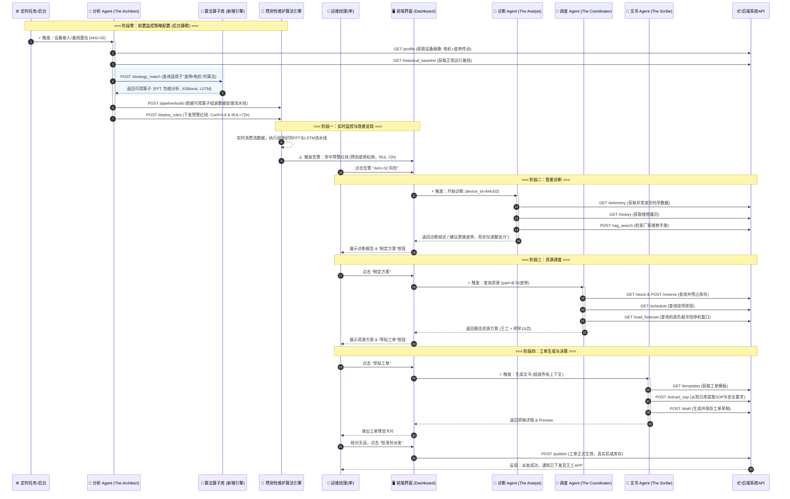

### 场景名称：数据中心精密空调（AHU）传动系统预测性维护

#### 1. 场景背景 (Context)
*   **地点**：银行核心数据中心 2号机房。
*   **核心设备**：AHU-02 精密空调（机房关键基础设施，负责核心服务器区域的恒温恒湿散热）。
*  **场景的时间跨度**：从设备接入平台/完成基线重估（T-30天） ➡️ 到隐患精准捕获（失效前 T-72小时）。
*   **触发事件**：
	* **前置布防**：在设备平稳运行期，AI 基于设备的物理画像（电机+皮带传动），为其**量身定制并自动下发**了频域振动监控与寿命预测算法流水线。 
	* **精准捕获**：数月后，该定制算法成功监测到风机驱动端产生特定低频谐波，推演判定为“皮带张力下降且伴随打滑”，预测 **72小时内** 将触达断裂临界值，从而触发“黄色预警”，避免了机房局部高温热点宕机事故。
*   **核心理念**：
	* AI 负责准备所有数据、方案和文书，人负责最后按按钮确认。
	* 实现运维模式从“黑盒式的被动救火”向“白盒式的自适应主动防御”跨越。
*   **涉及角色**：
    *   **AI Agents**：**异常分析Agent、设备诊断 Agent、工单调度 Agent 、 工单生成 Agent。
    *   **人类**：运维经理（决策者）、技师王工（执行者）。
* **涉及产品功能模块：**
	* 资产管理、告警模块、工单模块、Dashboard、DFS数据探索、DFS算法库（预测性维护算法包）。

#### 2. AI Agent 角色定义 (The Copilot Crew)
1. **异常分析 Agent (The Architect / 策略构建者)**：
	* **职责**：负责“建模型、定规则”。在新设备接入或定期健康巡检时，分析设备物模型与历史基线数据，自动匹配最适合的预测性维护算法（如 FFT、LSTM 等），并向监控系统下发动态告警规则。
2. **设备诊断 Agent (The Analyst)**：
    *   **职责**：负责“查病因”。结合告警数据，检索设备档案、维修历史和故障知识库，分析告警原因。
3.  **工单调度 Agent (The Coordinator)**：
    *   **职责**：负责“找资源”。查询备件库存、查询技师排班表、匹配最佳维修窗口。
4.  **工单生成 Agent (The Scribe)**：
    *   **职责**：负责“写文书”。自动草拟工单内容，填入SOP（标准作业程序）、安全注意事项、挂载附件。

---

#### 3. 详细业务流程及Agent触发方式执行链路

这个流程设计为 **“告警触发 -> 辅助分析 -> 方案筹备 -> 人工决策 -> 自动执行”** 的闭环。

##### 第一阶段：前置布防与隐患显现 (异常分析 Agent & Dashboard)
* **前置背景（隐形运行）**：在 AHU-02 接入系统或上一次大修后，**异常分析 Agent** 已经在后台默默完成了设备画像。它发现 AHU-02 包含风机、电机和皮带传动组件，基于其历史运行数据，Agent 自动为其配置了专属的“预测性维护监控策略”。
* **界面**：运维 **Dashboard** 地图上，AHU-02 节点原本为绿色，突然闪烁黄灯。
* **事件**：**告警模块** 弹出提示：“【预测预警（黄色）】AHU-02 风机驱动端存在皮带打滑风险（置信度 89%），预计 72 小时后触达失效阈值。” 
* **深层逻辑**：这个告警正是基于**异常分析 Agent** 前置下发的业务规则（`置信度 > 0.8` 且 `RUL < 72h`）被实时数据触发而产生的。
* **人工动作**：李经理点击告警，进入详情页。

> [!NOTE] Agent触发方式和执行链路——场景零：智能布防 (The Architect) 
>  *(注：此链路为系统后台自动运行，为触发告警做铺垫)* 
>  
>**1. 调起方式 (Trigger)** 
>  * **系统触发**：设备首次接入平台（`Device_Onboarding`）或系统执行每周健康基线重估任务（`Cron_Job: Weekly_Baseline_Review`）时，唤醒“异常分析 Agent”。 
>  
 >**2. Agent 执行与 API 调用链**
>  * **Step 1（描绘画像【调用设备档案与基线数据】）**：Agent 需要知道这是个什么设备，它正常的“心跳”是怎样的。
> 	 * 👉 **Call API**: `GET /api/device/profile` (识别出该设备含：三相异步电机、皮带传动、离心风机)
> 	 * 👉 **Call API**: `GET /api/device/telemetry/historical_baseline` (获取该设备过去30天无故障状态下的振动 RMS、电流均值) 
>  * **Step 2（故障模式与算法需求分析【Agent 内部大脑推理】）** ：Agent 作为一个“AI 数据科学家”，不急于找工具，而是先分析“如何捕捉这台设备的故障”。
> 	 * **Agent 内部思维链 (Chain of Thought)**：
> 		 1. 已知对象包含“皮带传动”。皮带老化的核心物理表现是：变长、松弛，进而导致高负载时打滑。
> 		 2. 打滑现象不会产生类似轴承碎裂那样的巨大冲击能量，而是会在频域上产生特定的低频谐波（如 1x 转速或皮带通过频率）。
> 		 3. 疲劳老化是一个时间序列上的长程非线性衰退过程。
> 	 * **得出需求结论**：为了监控该设备，**我需要（Needs）**：一个能处理高频振动的【频域特征提取算法】、一个能识别特定频率组合的【模式分类器】、以及一个具备长序记忆的【时间序列预测模型】。
> 	 * 👉 **Call API**: `POST /api/algorithm/strategy_match` (传入组件清单 `["belt_drive", "motor"]`) 
> * **Step 3（算法库寻址与能力匹配【调用DFS算法方法库】）**：Agent 拿着上一步推理出的“需求清单”，去DFS算法库里寻找能满足这些需求的具体算子。
> 	* 👉 **Call API**: `POST /api/algorithm/capability_match` (传入所需能力标签：`["frequency_domain_transform", "pattern_classification", "time_series_prediction"]`) > 
> 	* *系统返回*：匹配到具体算子：`[FFT算子, XGBoost模型, LSTM预测器]`。
> * **Step 4（组装工作流【调用DFS数据探索接口（配置工作流）】）**：Agent 将匹配到的具体算法串联，生成数据分析工作流。
> 	* 👉 **Call API**: `POST /api/algorithm/pipeline/build` (下发配置指令：原始振动数据 -> FFT算子 -> XGBoost分类 -> LSTM预测) 
> * **Step 5（下发规则与实时监控【调用规则引擎】）**：Agent 制定最后的判别红线，写入系统并开始默默守护。
> 	* 👉 **Call API**: `POST /api/rule_engine/deploy`
> * **Step 6（隐患触发与告警触达【调用消息推送与前端渲染】）** ： **时间推移与数据演变** ：设备持续运行了数月。某天，传感器实时采集到的 5kHz 振动数据流（Stream Data）在经过 Agent 0 组装的 `FFT算子` 时，12Hz（皮带通过频率）的幅值开始异常突增。**引擎计算**：数据流经流水线，`XGBoost` 输出皮带打滑置信度 `0.89`，`LSTM` 预测剩余寿命 RUL 下降至 `71h`。 **规则命中**：底层监控系统判定命中 Agent 0 当初设定的红线规则（`Conf > 0.8` 且 `RUL < 72h`）。
> 	* 👉 **Call API (后端推前端)**: `WebSocket Push /api/notification/alert` (向在线的运维人员广播告警事件，包含设备ID、故障模式、预测寿命)。
> 	* **用户侧 UI 呈现 (The Moment of Truth)**： 
> 		* 运维中心大屏（Dashboard）上，3D 机房拓扑图中的 AHU-02 节点瞬间由绿转为**闪烁的黄灯**。
> 		* 界面右上角弹出工单卡片：*“【预测预警】AHU-02 存在皮带打滑风险，预计 72 小时内失效。”*

##### 第二阶段：AI分析诊断 (设备诊断 Agent)
*   **交互**：详情页右侧的 AI 助手面板自动激活，显示“正在分析设备健康状况...”。
*   **Agent 执行**：
    *   **设备诊断 Agent** 读取振动频谱，对比历史基线，确认是“皮带松弛”而非“轴承磨损”。
    *   检索《AHU-02 维修履历》，发现上次更换皮带是 12个月前（通常寿命为12-18个月）。
    *   检索厂家手册，提取“皮带张力校准标准”。
*   **输出 (AI 建议)**：
     - **AI 助手**：“李经理，分析显示 AHU-02 皮带已接近疲劳寿命。
     - **结论**：建议更换皮带（优于仅调整张力）。
     - **依据**：运行已超 8000小时，且频谱显示高频谐波异常。
     - 是否制定更换方案？”
*   **人工动作**：李经理点击 **“制定方案”** 按钮。

> [!NOTE] Agent触发方式和执行链路——场景一：智能诊断 (The Analyst)
>
> **1. 调起方式 (Trigger)**
> *   **用户动作**：李经理在 Dashboard 点击“AHU-02 告警图标”，进入**设备详情页**。
> *   **系统触发**：前端页面加载完成（`Page_Load`）或组件挂载（`Component_Mount`）时，自动向后端发起异步请求，唤醒“设备诊断 Agent”。
> 
> **2. Agent 执行与 API 调用链**
> *   **Step 1（感知【调用告警异常数据】）**：Agent 接收到 `device_id: AHU-02`产生告警了，首先需要看现状。
>     *   👉 **Call API**: `GET /api/device/telemetry/timeseries` (获取振动、电流等时序数据)
> *   **Step 2（回忆【调用历史工单】）**：Agent 需要知道这个设备的“病史”。
>     *   👉 **Call API**: `GET /api/maintenance/history` (获取上次维修时间和内容)
> *   **Step 3（查书【调用知识库】）**：Agent 发现数据异常，需要去查阅技术手册标准。
>     *   👉 **Call API**: `POST /api/knowledge/rag_search` (检索“皮带张力标准”和“故障频谱对照表”)
> *   **Step 4（推理与输出）**：Agent 内部的大模型（LLM）汇总上述信息，生成诊断结论，返回给前端展示。

##### 第三阶段：资源与排程筹备 (工单调度 Agent)
*   **交互**：AI 界面显示“正在查询库存与排班...”。
*   **Agent 执行**：
    *   **工单调度 Agent** 访问库存系统：查询“B-52型 三角皮带”，锁定库存 4条。
    *   访问排班系统：发现资深技师“王工”在明天（周三）上午 10:00-11:00 有空档。
    *   访问环境监测系统：预测明天上午机房负载较低，适合停机 30分钟。
*   **输出 (AI 建议)**：
     - **AI 助手**：“资源已就绪。
     - **备件**：B-52 皮带 x 2（已预占）。
     - **时间**：建议明天 10:00-11:00（低负载窗口）。
     - **人员**：推荐王工（擅长此类维修）。
     - 是否草拟工单？”
*   **人工动作**：李经理点击 **“草拟工单”** 按钮。

> [!NOTE] Agent触发方式和执行链路——场景二：资源调度 (The Coordinator)
> **1. 调起方式 (Trigger)**
> *   **用户动作**：李经理阅读完诊断结论，点击界面上的 **“制定维修方案” (Button OnClick)** 按钮。
> *   **系统触发**：前端捕获点击事件，将诊断出的关键参数（如“需更换皮带 B-52”）打包，调用“工单调度 Agent”的接口。
> 
> **2. Agent 执行与 API 调用链**
> *   **Step 1（查物资【调用备件管理】）**：Agent 根据上一步的结论，去查备件。
>     *   👉 **Call API**: `GET /api/inventory/stock` (查询 B-52 皮带库存)
>     *   👉 **Call API**: `POST /api/inventory/reserve` (软锁定库存，防止被抢)
> *   **Step 2（查人力【调用用户管理】）**：Agent 查找谁能修。
>     *   👉 **Call API**: `GET /api/staff/schedule` (查询具备 HVAC 资质且有空档的技师)
> *   **Step 3（查天时【调用设备运行数据】）**：Agent 查找什么时候修影响最小。
>     *   👉 **Call API**: `GET /api/datacenter/load_forecast` (获取机房负载预测数据)
> *   **Step 4（规划与输出）**：Agent 组合出“最佳人选+最佳时间+备件情况”，返回给前端。

##### 第四阶段：文书自动生成 (工单生成 Agent)
*   **交互**：屏幕中央弹出一个 **“工单预览卡片”** 。
*   **Agent 执行**：
    *   **工单生成 Agent** 并不直接创建工单，而是生成一个**草稿**。
    *   它将诊断结果填入“故障描述”。
    *   它将调度信息填入“计划时间”和“执行人”。
    *   **关键点**：它自动从知识库中提取了 **5条标准操作步骤 (SOP)** 和 **2条安全警示（如：断电挂牌）** 填入“作业指导书”字段。
*   **输出**：一张内容详实、填写完整的工单草稿呈现在李经理面前。

> [!NOTE] Agent触发方式和执行链路——场景三：工单生成 (The Scribe)
> **1. 调起方式 (Trigger)**
> *   **用户动作**：李经理确认方案无误，点击 **“草拟工单” (Button OnClick)** 按钮。
> *   **系统触发**：前端将前两个 Agent 产出的所有上下文（诊断结果、选定的技师、时间、备件），发送给“工单生成 Agent”。
> 
> **2. Agent 执行与 API 调用链**
> *   **Step 1（找模板【调用工单模板】）**：Agent 确定这是一个“机械维修”任务。
>     *   👉 **Call API**: `GET /api/workorder/templates` (拉取标准表单结构)
> *   **Step 2（写SOP【调用生成工单】）**：Agent 需要把具体的修法写进去。
>     *   👉 **Call API**: `POST /api/knowledge/extract_sop` (从知识库提取“皮带更换步骤”和“安全注意事项”)
> *   **Step 3（存草稿【调用工单填写】）**：Agent 将填好的所有内容组装成 JSON。
>     *   👉 **Call API**: `POST /api/workorder/draft` (在数据库生成一条待审批的工单记录)
> *   **Step 4（展示）**：后端返回 `draft_id` 和预览数据，前端弹出“工单预览卡片”。
> 

##### 第五阶段：运维经理决策
*  **界面**：工单预览卡片底部有两个大按钮：**“修改草稿”** 和 **“批准并派发”**。
*   **人工动作**：
    1.  李经理快速浏览草稿，看到 AI 已经把最麻烦的 SOP 和 备件号 都填好了。
    2.  他认为无需修改，直接点击 **“批准并派发”**。
*   **系统反馈**：
    *   工单正式生成并下发给王工的手机 App。
    *   库存自动扣减。
    *   Dashboard 显示 AHU-02 进入“计划维修”状态。

##### 第六阶段：闭环验证
*   **后续**：王工第二天按 AI 建议的时间完成了维修。
*   **验证**：设备重启，预测算法重新计算，确认振动异常消失。李经理在 Dashboard 上看到设备转绿，同时也看到了本次操作节省的潜在宕机成本统计。

---

### 4. Agent触发及执行流程图
这张图展示了**用户（李经理）**、**前端界面（UI）**、**三个 AI Agent** 以及 **后端基础服务** 之间的交互关系。

### 5. 场景拆解 CheckList (便于后续方案撰写)

为了便于你写需求文档和 Demo 脚本，以下是模块功能的详细对应：

| 步骤        | 涉及模块               | AI Agent 动作 (Copilot)       | 用户动作 (Captain) | 核心价值               |
| :-------- | :----------------- | :-------------------------- | :------------- | :----------------- |
| **1. 发现** | **告警模块**、Dashboard | (无，传统阈值/算法触发)               | 查看告警详情         | 及时发现隐患             |
| **2. 诊断** | 设备管理、知识库           | **设备诊断 Agent**：查历史、查手册、定根因  | 点击“制定方案”       | 省去查阅资料的时间，提供决策依据   |
| **3. 筹备** | 库存模块、排班系统          | **工单调度 Agent**：查库存、查排班、定时间  | 点击“草拟工单”       | 省去跨系统（ERP/HR）查询的繁琐 |
| **4. 草拟** | **工单模块**           | **工单生成 Agent**：写描述、填SOP、挂附件 | 浏览工单草稿         | 保证工单规范性，减少录入工作量    |
| **5. 决策** | **工单模块**           | (无，等待指令)                    | **点击“批准并派发”**  | **保留最终决策权，确保业务安全** |
| **6. 执行** | 工单执行               | （当前无）                       | 按工单步骤操作        |                    |

**参考内容：**
[^1]: 
	核心算法流水线，整个计算过程是漏斗：**数据清洗 -> 特征提取 -> 模式识别 -> 寿命预测 -> 告警输出**。
	
 1. 信号处理与特征提取算法包 (The Signal Processor)
	**任务**：将看不懂的原始波形（Raw Data），翻译成机器能理解的“指纹特征”。
	*   **输入**：高频振动加速度数据（Time Series）、电机电流信号。
	*   **核心算法**：
	    *   **FFT (快速傅里叶变换)**：
	        *   *作用*：将时域波形转换为频域频谱。
	        *   *场景应用*：皮带故障通常不会像轴承那样产生尖锐的高频冲击，而是表现为 **低频段（1x 转速或皮带通过频率 BPF）** 的能量升高。FFT 能把这些“特定频率”揪出来。
	    *   **Hilbert-Huang Transform (希尔伯特-黄变换 / 包络分析)**：
	        *   *作用*：解调信号。
	        *   *场景应用*：当皮带松弛导致打滑时，会产生“调制”现象（时断时续的冲击）。包络分析能有效提取出这种打滑引发的周期性冲击特征，**区分是“松动”还是单纯的“不平衡”**。
	    *   **时域统计特征计算**：
	        *   *算法*：计算 RMS（有效值，代表总能量）、Kurtosis（峭度，代表冲击性）、Skewness（偏度）。
	        *   *场景应用*：RMS 升高说明整体振动大了，峭度升高说明有“拍打”现象（皮带拍打护罩或轮槽）。
	
 2. 故障模式识别算法包 (The Classifier)
	**任务**：拿着提取出的特征，判断到底是什么病（是皮带松了？还是轴承坏了？）。
	*   **输入**：上述提取的特征向量（Feature Vectors）。
	*   **核心算法**：
	    *   **Random Forest (随机森林) 或 XGBoost**：
	        *   *作用*：监督学习分类器。
	        *   *场景应用*：利用历史标注数据（比如过去5年积累的维修记录），训练模型识别特征组合。
	        *   *判定逻辑*：如果 `低频能量高` + `峭度中等` + `电流波动大` = **皮带松弛（概率 89%）**；如果 `高频能量极高` = **轴承磨损**。这是算法区分“病因”的关键。
	    *   **One-Class SVM (单分类支持向量机)**：
	        *   *作用*：异常检测（无监督学习）。
	        *   *场景应用*：不需要知道具体是什么故障，只需要知道“当下的数据分布”已经严重偏离了“AHU-02 刚保养完的健康基线”。这是触发黄色预警的第一道门槛。
	
 3. RUL 剩余寿命预测算法包 (The Prognostics)
	**任务**：预测“72小时”这个时间点。
	*   **输入**：历史趋势数据 + 当前衰退速率。
	*   **核心算法**：
	    *   **LSTM (长短期记忆网络) / GRU**：
	        *   *作用*：处理时间序列的深度学习模型，擅长记忆长期依赖关系。
	        *   *场景应用*：输入过去 30 天的皮带张力指数（通过振动频率反推），模型学习衰退曲线（Degradation Curve）。它发现最近 24 小时衰退在加速，推算出曲线触达“临界失效阈值”的时间点在 72 小时后。
	    *   **Exponential Degradation Model (指数退化模型 - 基于物理统计)**：
	        *   *作用*：基于物理磨损规律的回归模型。
	        *   *场景应用*：皮带的疲劳往往符合指数级恶化规律（越松越打滑，越打滑磨损越快）。利用粒子滤波（Particle Filter）算法更新模型参数，动态修正剩余寿命预测。
	
 4.  综上，以下是完整的数据流向：
	1.  **数据采集**：传感器以 5kHz 采样率采集 AHU-02 驱动端振动。
	2.  **特征工程 (Step 1)**：
	    *   调用 **FFT 算法**，发现 **25Hz (电机转速)** 和 **12Hz (皮带通过频率)** 处的幅值显著上升。
	    *   调用 **时域统计算法**，发现 **RMS 值** 较上周增长了 15%。
	3.  **故障诊断 (Step 2)**：
	    *   将 `[25Hz幅值, 12Hz幅值, RMS, 峭度]` 输入 **XGBoost 分类模型**。
	    *   模型输出分类结果：`Label: Belt_Looseness`，`Confidence: 0.89`。
	    *   *此时，排除了轴承故障（因为轴承特征未被激活）。*
	4.  **寿命预测 (Step 3)**：
	    *   将该特征输入 **LSTM 预测模型**。
	    *   模型预测未来趋势，输出：`RUL (Remaining Useful Life) = 72 hours`。
	5.  **告警生成**：
	    *   规则引擎判定：`Confidence > 0.8` 且 `RUL < 72h`。
	    *   **触发动作**：生成“黄色预警”，推送到 Dashboard。

