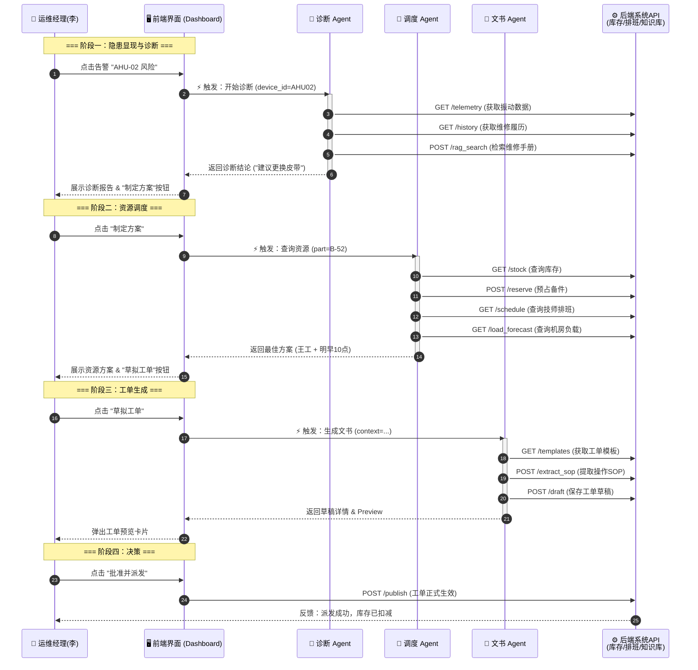

好的，这个需求非常关键。作为产品经理，明确 **“触发机制（Trigger）”** 和 **“调用链（Call Chain）”**是确保前端交互与后端逻辑对齐的核心。

以下是按照 **“触发 -> Agent觉醒 -> 动作执行 -> API调用”** 的逻辑进行的详细拆解，最后附带一份 Mermaid 流程图。

---

### 一、 详细文字拆解：Agent 调起与执行链路

#### 场景一：智能诊断 (The Analyst)
**1. 调起方式 (Trigger)**
*   **用户动作**：李经理在 Dashboard 点击“AHU-02 告警图标”，进入**设备详情页**。
*   **系统触发**：前端页面加载完成（`Page_Load`）或组件挂载（`Component_Mount`）时，自动向后端发起异步请求，唤醒“设备诊断 Agent”。

**2. Agent 执行与 API 调用链**
*   **Step 1（感知）**：Agent 接收到 `device_id: AHU-02`，首先需要看现状。
    *   👉 **Call API**: `GET /api/device/telemetry/timeseries` (获取振动、电流等时序数据)
*   **Step 2（回忆）**：Agent 需要知道这个设备的“病史”。
    *   👉 **Call API**: `GET /api/maintenance/history` (获取上次维修时间和内容)
*   **Step 3（查书）**：Agent 发现数据异常，需要去查阅技术手册标准。
    *   👉 **Call API**: `POST /api/knowledge/rag_search` (检索“皮带张力标准”和“故障频谱对照表”)
*   **Step 4（推理与输出）**：Agent 内部的大模型（LLM）汇总上述信息，生成诊断结论，返回给前端展示。

---

#### 场景二：资源调度 (The Coordinator)
**1. 调起方式 (Trigger)**
*   **用户动作**：李经理阅读完诊断结论，点击界面上的 **“制定维修方案” (Button OnClick)** 按钮。
*   **系统触发**：前端捕获点击事件，将诊断出的关键参数（如“需更换皮带 B-52”）打包，调用“工单调度 Agent”的接口。

**2. Agent 执行与 API 调用链**
*   **Step 1（查物资）**：Agent 根据上一步的结论，去查备件。
    *   👉 **Call API**: `GET /api/inventory/stock` (查询 B-52 皮带库存)
    *   👉 **Call API**: `POST /api/inventory/reserve` (软锁定库存，防止被抢)
*   **Step 2（查人力）**：Agent 查找谁能修。
    *   👉 **Call API**: `GET /api/staff/schedule` (查询具备 HVAC 资质且有空档的技师)
*   **Step 3（查天时）**：Agent 查找什么时候修影响最小。
    *   👉 **Call API**: `GET /api/datacenter/load_forecast` (获取机房负载预测数据)
*   **Step 4（规划与输出）**：Agent 组合出“最佳人选+最佳时间+备件情况”，返回给前端。

---

#### 场景三：工单生成 (The Scribe)
**1. 调起方式 (Trigger)**
*   **用户动作**：李经理确认方案无误，点击 **“草拟工单” (Button OnClick)** 按钮。
*   **系统触发**：前端将前两个 Agent 产出的所有上下文（诊断结果、选定的技师、时间、备件），发送给“工单生成 Agent”。

**2. Agent 执行与 API 调用链**
*   **Step 1（找模板）**：Agent 确定这是一个“机械维修”任务。
    *   👉 **Call API**: `GET /api/workorder/templates` (拉取标准表单结构)
*   **Step 2（写SOP）**：Agent 需要把具体的修法写进去。
    *   👉 **Call API**: `POST /api/knowledge/extract_sop` (从知识库提取“皮带更换步骤”和“安全注意事项”)
*   **Step 3（存草稿）**：Agent 将填好的所有内容组装成 JSON。
    *   👉 **Call API**: `POST /api/workorder/draft` (在数据库生成一条待审批的工单记录)
*   **Step 4（展示）**：后端返回 `draft_id` 和预览数据，前端弹出“工单预览卡片”。

---

### 二、 业务流程图 (Mermaid Sequence Diagram)

这张图展示了**用户（李经理）**、**前端界面（UI）**、**三个 AI Agent** 以及 **后端基础服务** 之间的交互关系。

### 给 PM 的补充说明：
1.  **关于“上下文（Context）”的传递**：
    *   请注意，流程图中 Agent 2 需要知道 Agent 1 的结果（比如要换什么零件），Agent 3 需要知道 Agent 2 的结果（比如谁来修）。
    *   **技术实现建议**：在前端维持一个 `Session Context` 对象，或者后端使用 `Conversation ID` 来把这三步串起来，避免 Agent 2 问“你要我查什么备件？”
2.  **关于“异步等待”**：
    *   Agent 的分析可能需要 2-3 秒（特别是 RAG 检索和 LLM 生成）。
    *   **交互建议**：点击按钮后，UI 必须要有明显的 **Loading 动画**（比如“AI 正在思考中...”），以免用户以为死机了重复点击。

这套流程图和文字描述配合使用，开发人员应该能非常清楚地理解你的意图了