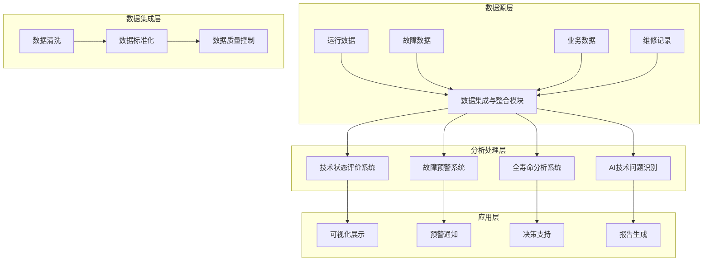
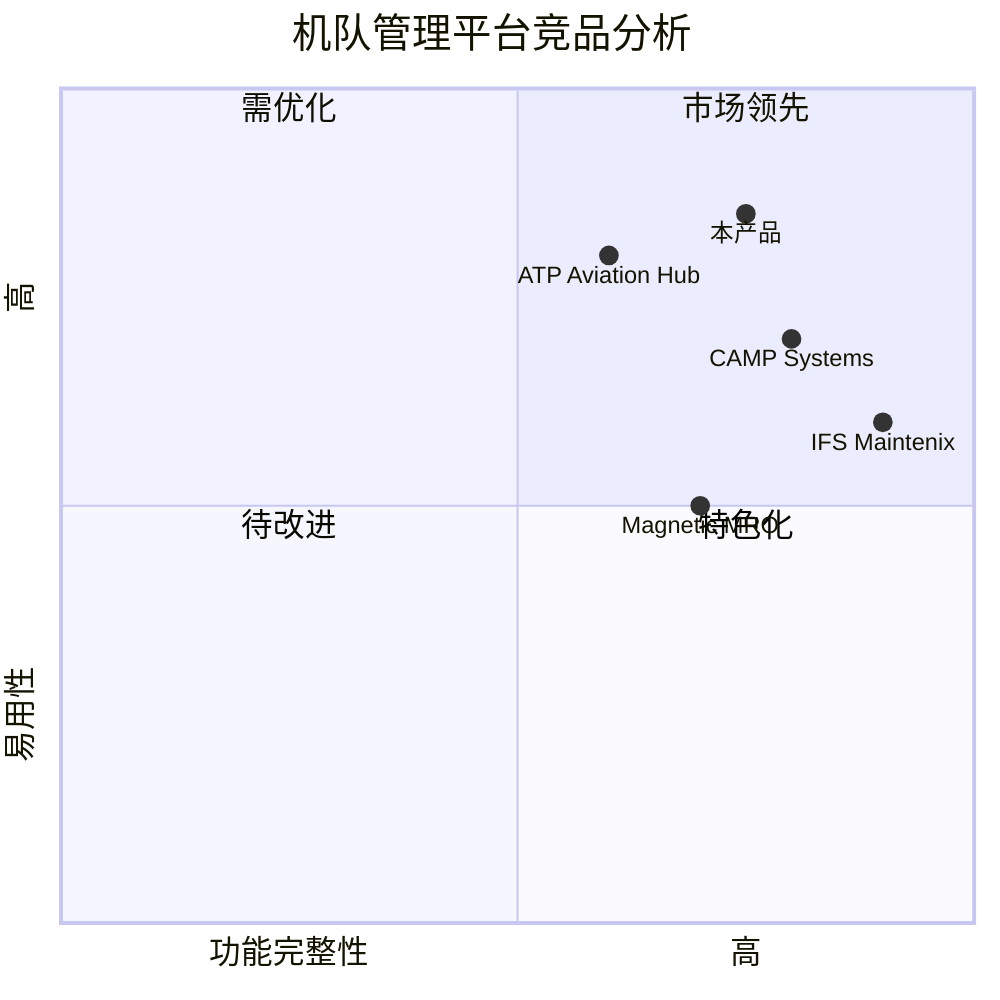

# 机队技术状态量化评估和智能化管理平台 - 产品需求文档(PRD)

## 1. 项目概述

### 1.1 项目背景
本项目旨在构建一个多源异构数据集成平台，通过先进的数据分析和人工智能技术，实现机队技术状态的量化评估和智能化管理。该平台将帮助航空公司和维修机构更好地把握机队技术状态，提前预警可能的故障，优化维修策略，提高运营效率。

### 1.2 产品目标
1. **数据整合与标准化**：实现多源数据的无缝集成，建立统一的数据标准
2. **智能分析与预警**：提供实时的技术状态评估和故障预警能力
3. **全生命周期管理**：实现设备全寿命周期的可靠性分析和维护优化

### 1.3 用户故事
- 作为机队维修工程师，我希望能够实时查看设备的技术状态评估报告，以便及时发现潜在问题
- 作为维修计划人员，我希望获得准确的故障预测信息，以便优化维修计划和资源配置
- 作为技术管理人员，我需要查看设备全生命周期的可靠性分析报告，以制定长期维护策略
- 作为数据分析师，我需要访问标准化的历史数据，以进行深入的趋势分析

## 2. 系统功能架构

### 2.1 整体架构

### 2.2 竞品分析

## 3. 核心功能模块

### 3.1 数据集成与整合模块（P0）

#### 3.1.1 数据接入
- **必须** 支持多种数据源接入（包括但不限于CSV、JSON、XML等格式）
- **必须** 提供标准化的数据接口规范
- **必须** 支持实时和批量数据导入

#### 3.1.2 数据清洗与标准化
- **必须** 实现数据格式统一化处理
- **必须** 提供数据质量检测机制
- **应该** 支持自定义数据清洗规则

#### 3.1.3 数据匹配与关联
- **必须** 建立跨平台数据映射关系
- **必须** 提供数据关联性分析工具
- **应该** 支持元数据管理功能

### 3.2 技术状态评价及故障预警系统（P0）

#### 3.2.1 状态评估
- **必须** 支持实时技术状态量化评估
- **必须** 提供多维度评估指标体系
- **必须** 支持历史趋势分析

#### 3.2.2 故障预警
- **必须** 实现基于机器学习的故障预测
- **必须** 提供多级预警机制
- **应该** 支持预警规则自定义

#### 3.2.3 风险评估
- **必须** 提供风险等级评估
- **必须** 生成处理方案建议
- **应该** 支持风险演变趋势分析

### 3.3 全寿命技术状态分析系统（P1）

#### 3.3.1 可靠性分析
- **必须** 建立系统/附件可靠性模型
- **必须** 支持故障率变化趋势分析
- **应该** 提供寿命预测功能

#### 3.3.2 维修策略优化
- **必须** 提供基于可靠性的维修建议
- **必须** 支持备件需求预测
- **应该** 实现维修成本优化分析

### 3.4 基于AI的技术问题识别应用（P1）

#### 3.4.1 智能数据处理
- **必须** 支持大语言模型的文本处理
- **必须** 实现自动信息提取
- **应该** 提供智能数据分类功能

#### 3.4.2 知识图谱构建
- **必须** 建立航空领域专业知识库
- **必须** 支持多维度数据关联分析
- **应该** 提供知识图谱可视化功能

## 4. 技术要求

### 4.1 系统性能要求
- 系统响应时间：页面加载 < 3秒
- 数据处理能力：支持每日>1TB数据处理
- 系统可用性：99.9%
- 并发用户数：支持>1000用户同时在线

### 4.2 安全要求
- **必须** 实现基于角色的访问控制
- **必须** 支持数据加密传输和存储
- **必须** 提供完整的审计日志
- **必须** 实现数据备份和恢复机制

## 5. 项目实施优先级

### P0（必须实现）
- 数据集成与整合基础功能
- 技术状态实时评估
- 关键故障预警功能
- 基础可靠性分析

### P1（应该实现）
- 全寿命周期分析
- AI辅助分析功能
- 知识图谱构建
- 高级数据可视化

### P2（可选实现）
- 移动端应用
- 离线分析功能
- 多语言支持
- 自定义报表功能

## 6. 开放问题

1. 数据源系统的接口标准是否需要统一？
2. 是否需要支持离线运行模式？
3. AI模型的训练和更新周期如何确定？
4. 是否需要支持第三方系统集成？
5. 数据存储的保留期限如何确定？

## 7. 验收标准

1. 数据集成准确率达到99.9%以上
2. 故障预警准确率>90%
3. 系统响应时间满足性能要求
4. 完成所有P0功能的开发和测试
5. 通过安全性测试和压力测试